# ADR 0007: Represent Dated Vendor Chances As Opportunities

## Context

This project is a private, local-first operating system for discovering opportunities and planning operations for a food vending business in and around Drenthe. It will likely be implemented over multiple sessions with help from AI coding agents. Decisions must be explicit so the project stays coherent.

## Decision

Use Opportunity as the central dated planning entity; use Opportunity Series for recurring/named concepts.

## Consequences

Allows weekly/monthly/annual events to become individual planning records.

## Alternatives Considered

- Leave the decision implicit in chat history.
- Let the coding agent infer the design.
- Choose a broader or more complex option earlier than needed.

## Review Trigger

Review this ADR if the project scope, deployment model, data model, or primary workflow changes materially.

## Resources

- 
- [Domain model reference](../DOMAIN_MODEL.md)
