# ADR 0026: Treat Venues As Managed Domain Records

## Context

Opportunities and engagements repeatedly refer to physical venues. Keeping venue details only as free text would duplicate addresses, coordinates, access notes, and contact information and would weaken map, distance, and year-over-year planning.

## Decision

Treat venues as managed domain records that opportunities can reference. Keep stable place information on the venue and keep opportunity- or engagement-specific arrangements on their respective records.

## Consequences

- Addresses, coordinates, accessibility details, and stable venue notes can be reused.
- Opportunity dates, application details, setup instructions, and engagement actuals do not belong on the venue.
- Venue corrections can improve future planning without rewriting historical operational facts.

## Alternatives Considered

- Store the venue as free text on every opportunity.
- Copy all planning and result details onto venue records.
- Introduce a third-party venue service as the source of truth.

## Review Trigger

Review this ADR if venue identity, geocoding, or historical-address requirements need a more specialized model.

## Resources

- 
- [Venue schema reference](../VENUE_SCHEMA.md)
- [Venue field dictionary](../VENUE_FIELD_DICTIONARY.md)
- [Venue SQL DDL](../VENUE_SCHEMA_SQL_DDL.md)
